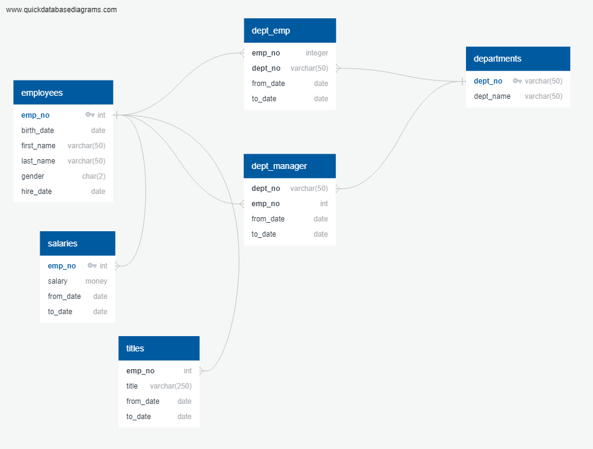
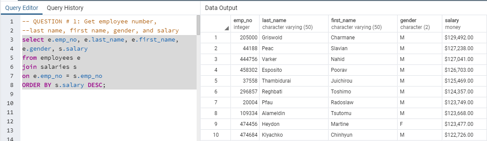
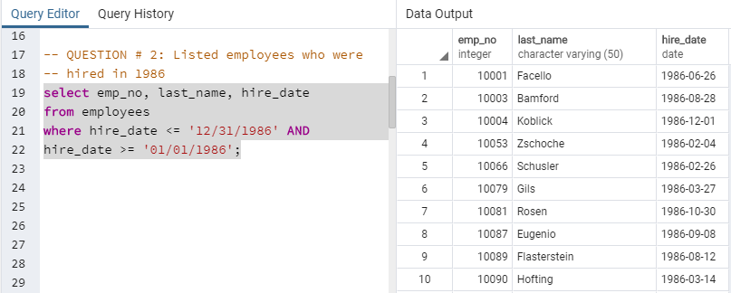
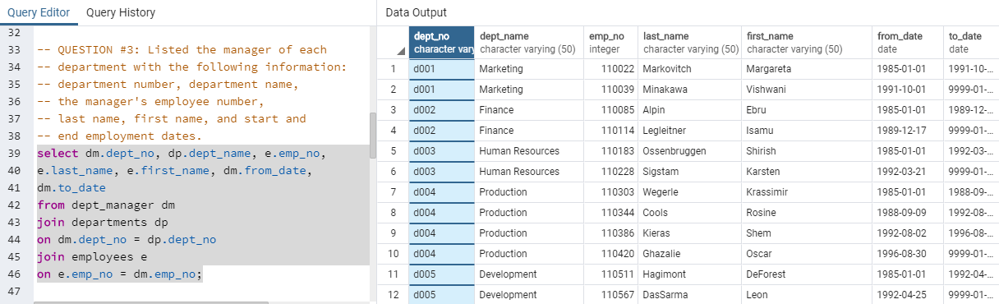
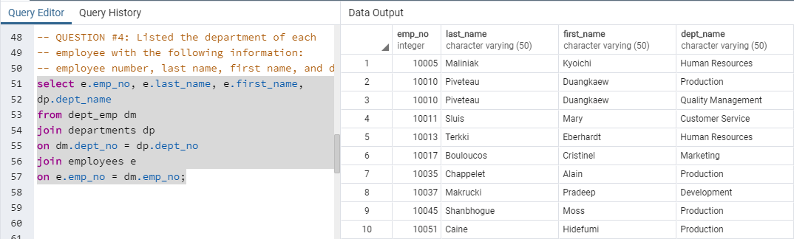
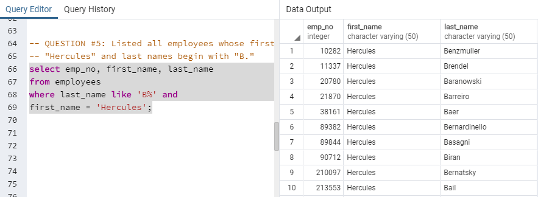
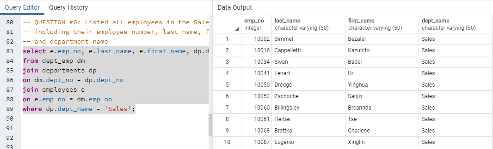
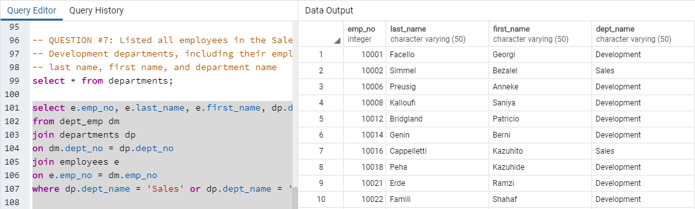
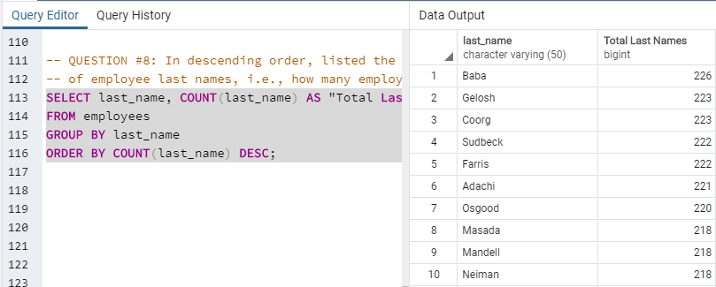
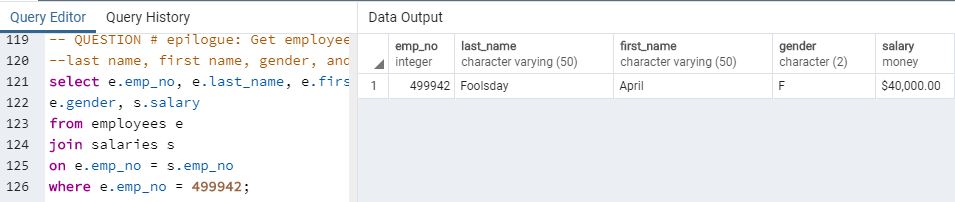

# Employee Database: A Mystery in Two Parts

## Background

It is a beautiful spring day, and it is two weeks since I have been hired as a new data engineer at Pewlett Hackard. My first major task is a research project on employees of the corporation from the 1980s and 1990s. All that remain of the database of employees from that period are six CSV files.

In this assignment, designed the tables to hold data in the CSVs, imported the CSVs into a SQL database, and answered questions about the data. In other words, I performed:

1. Data Modeling

2. Data Engineering

3. Data Analysis

## Instructions

#### Data Modeling

I inspected the CSVs and sketched out an ERD of the tables. I used the following tool to pertform this sketch: [http://www.quickdatabasediagrams.com](http://www.quickdatabasediagrams.com).

After several iterations I obtained the following structure, that worked fine when importing the csv data into the data base.

#### Data Engineering

* With the information gathered after inspecting the CSV file I created a table schema for each of the six CSV files in the ERD. I specified data types, primary keys, foreign keys, and other constraints. 

* Found an issue with the table titles, as there were more than title associated to an emp_no, so I ended up not assigning any primary key on this table.

* Imported each CSV file into the corresponding SQL table.

#### Data Analysis

Once I completed the database, I did the following:

1. Listed the following details of each employee: employee number, last name, first name, gender, and salary.

I ordered it in descent order by salary, the highest salary is $129k

2. Listed employees who were hired in 1986. 36150 employees were hired in this period

3. Listed the manager of each department with the following information: department number, department name, the manager's employee number, last name, first name, and start and end employment dates.

4. Listed the department of each employee with the following information: employee number, last name, first name, and department name.

5. Listed all employees whose first name is "Hercules" and last names begin with "B."

6. Listed all employees in the Sales department, including their employee number, last name, first name, and department name.

7. Listed all employees in the Sales and Development departments, including their employee number, last name, first name, and department name.

8. In descending order, listed the frequency count of employee last names, i.e., how many employees share each last name.

## Epilogue

Evidence in hand, I marched into my boss's office and presented the results. With a sly grin, my boss thanks me for my work. On my way out of the office, I hear the words, "Search your ID number." You look down at your badge to see that your employee ID number is 499942. So here youg o, than you guys, that's a funny one!

## Submission

* Created an image file of my ERD.

* Created a `.sql` file of my table schemata.

* Created a `.sql` file of my queries.

* Create and upload a repository with the above files to GitHub and post a link on BootCamp Spot.

## Authors

* **Nicolas Gomez Bustamante** - *Initial work* - [PurpleBooth](https://github.com/nbg1)
